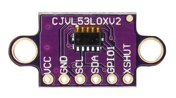

# vl53l0x
A Node.js library for [a vl53l0x proximity sensor](https://amzn.to/2AP12Yw).<br>
<br>
<a href="https://amzn.to/2AP12Yw">

</a>

https://npmjs.com/package/vl53l0x<br>
https://npmjs.com/package/i2c-bus
```
npm install vl53l0x i2c-bus
```

...**OR**, use an [i2cdriver](https://npmjs.com/package/i2cdriver) for development!
```
npm install vl53l0x i2cdriver
```

## Use
```js
const VL53L0X = require('vl53l0x')
const args = [1, 0x29]
// Optionally, try developing with an i2cdriver!
// const args = ['/dev/tty.usbserial-DO01INSW', 0x29, 'i2cdriver/i2c-bus']

VL53L0X(...args).then(async (vl53l0x) => {
  while(true) {
    console.log(await vl53l0x.measure())
  }
})
.catch(console.error)
```

#### *i2c-bus not included in dependencies
To prevent multiple  instances of [i2c-bus](https://npmjs.com/package/i2c-bus)
being installed in your project- it is NOT included as a dependency. You just
need to install it separately.

This also allows you to swap in a different bus, such as an [i2cdriver](https://npmjs.com/package/i2cdriver) if desired.

## Interface

### VL53L0X(bus, address)
Creates a VL53L0X instance.

**bus:** The [i2c-bus-promise](https://www.npmjs.com/package/i2c-bus-promise) instance<br>
**address:** The i2c device address (factory default is `0x29`). Changing it is a pain and this
library doesn't aim to take that on.

**Returns:** The VL53L0X interface.

#### measure()
Gets a measurement from the device.

**Returns:** The distance in millimeters (Number)


## Other functions...
There are additional functions exposed but you'll really need to read [the datasheet](https://www.st.com/resource/en/datasheet/vl53l0x.pdf)
to get an understanding of what each does. You can [checkout the examples](examples/) also.

**getSignalRateLimit()**<br>
**setSignalRateLimit(limit_Mcps)**<br>

**getMeasurementTimingBudget()**<br>
**setMeasurementTimingBudget(timing_budget)**<br>

**getVcselPulsePeriod()**<br>
**setVcselPulsePeriod(type, period_pclks)**<br>

**performSingleRefCalibration(vhv_init_byte)**<br>


# References
https://www.st.com/resource/en/datasheet/vl53l0x.pdf

# License
MIT
